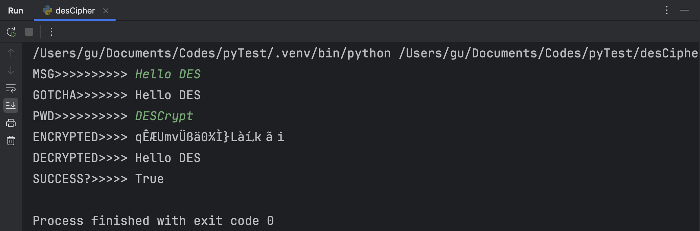
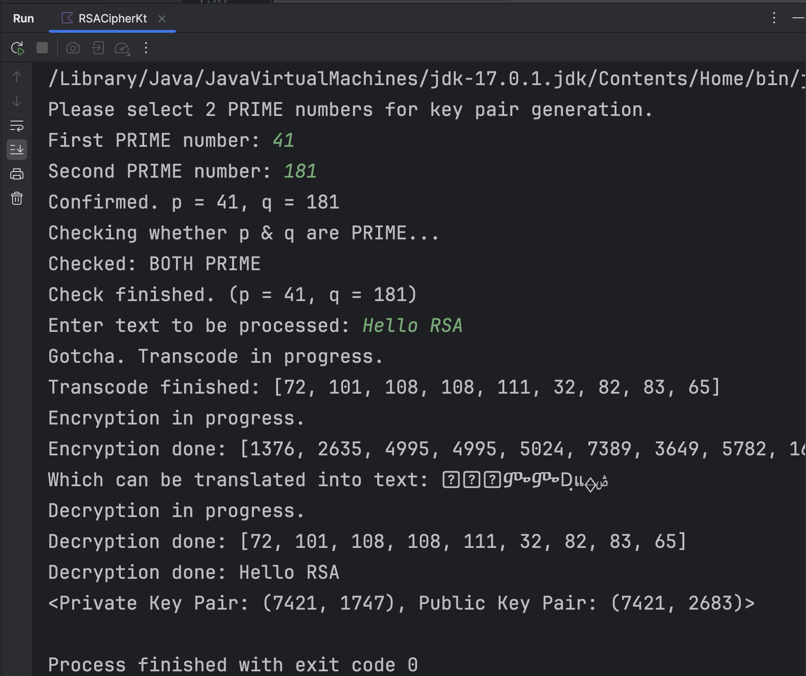
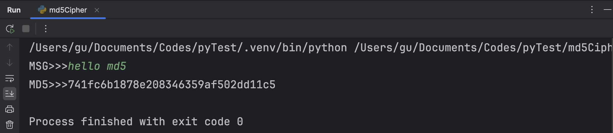
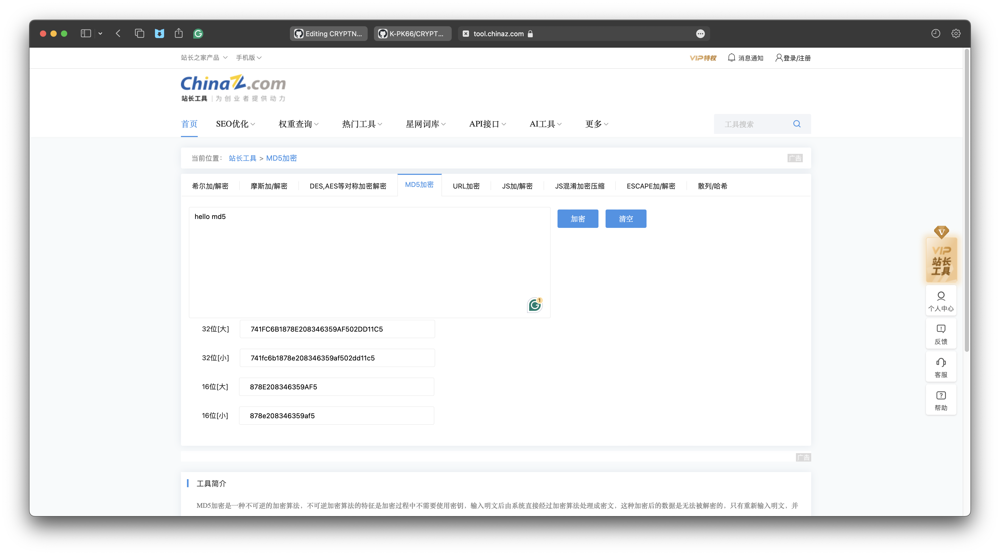
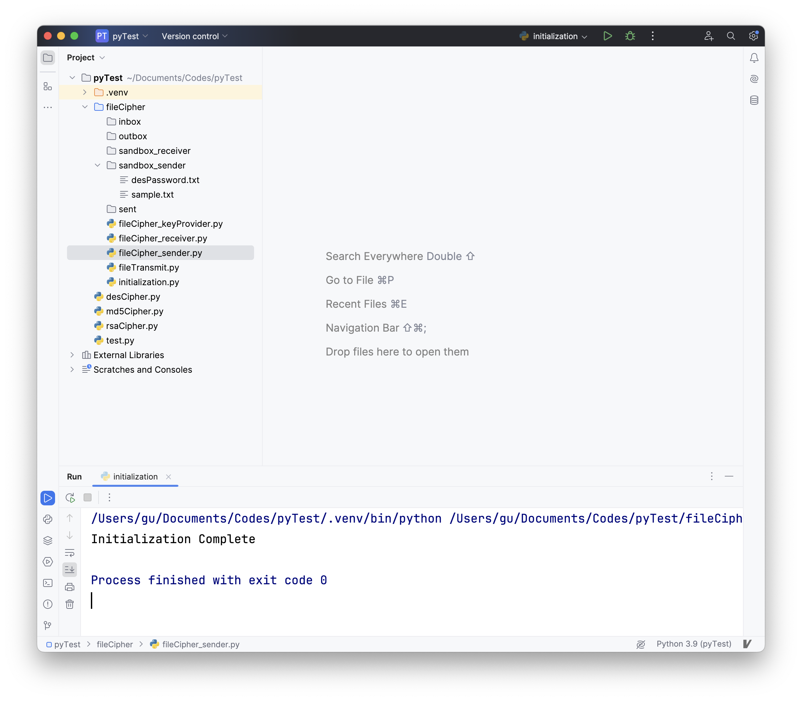
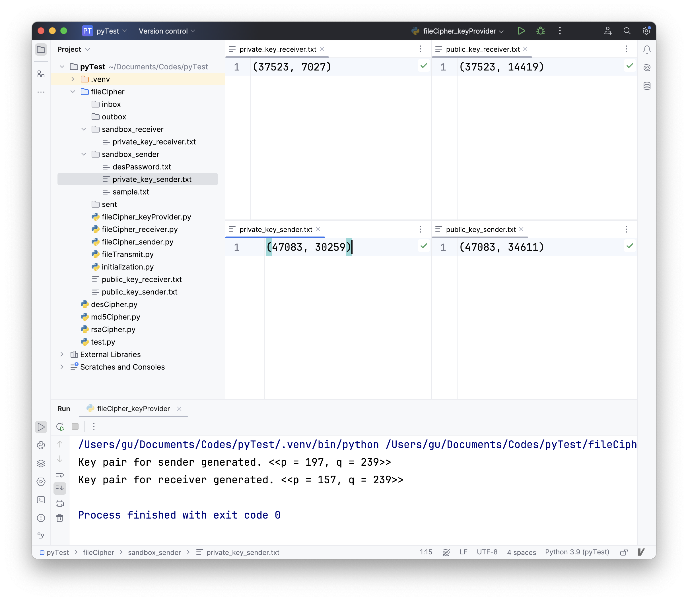
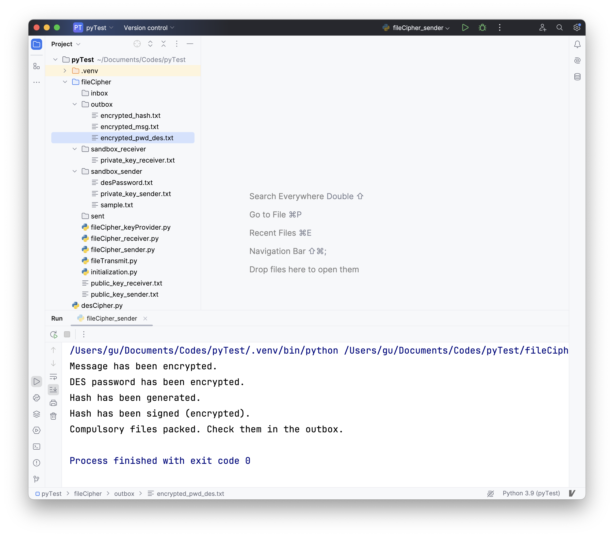
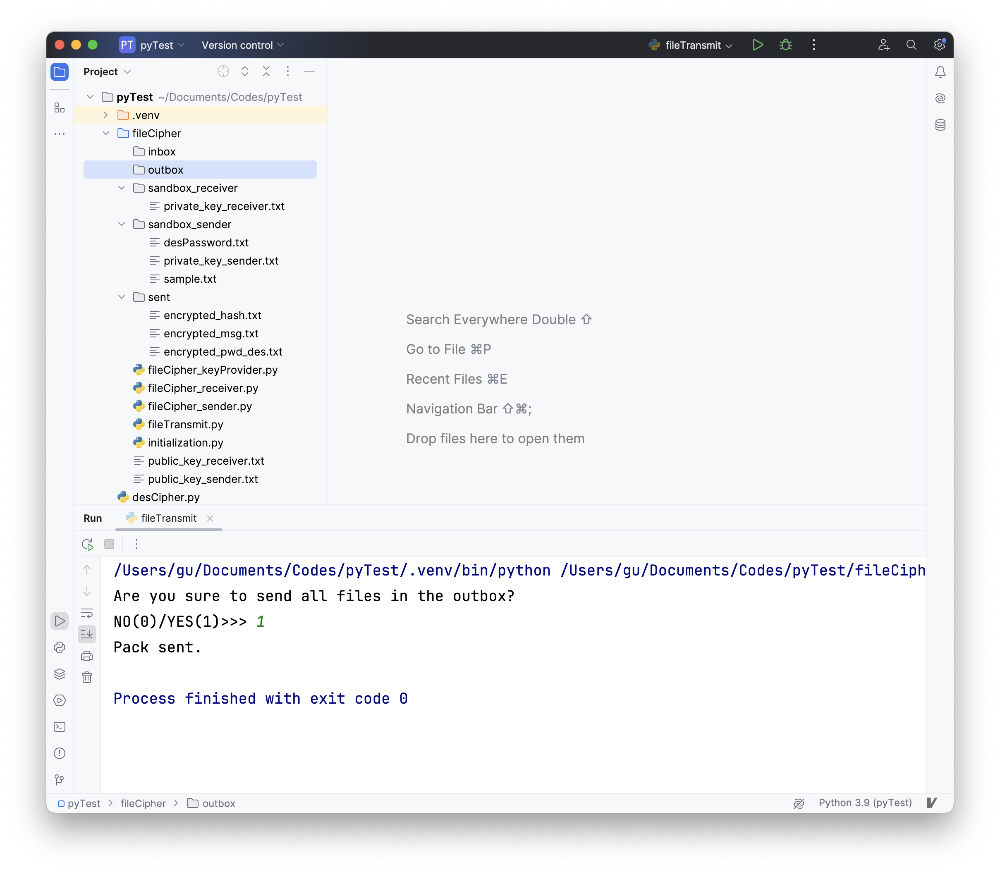
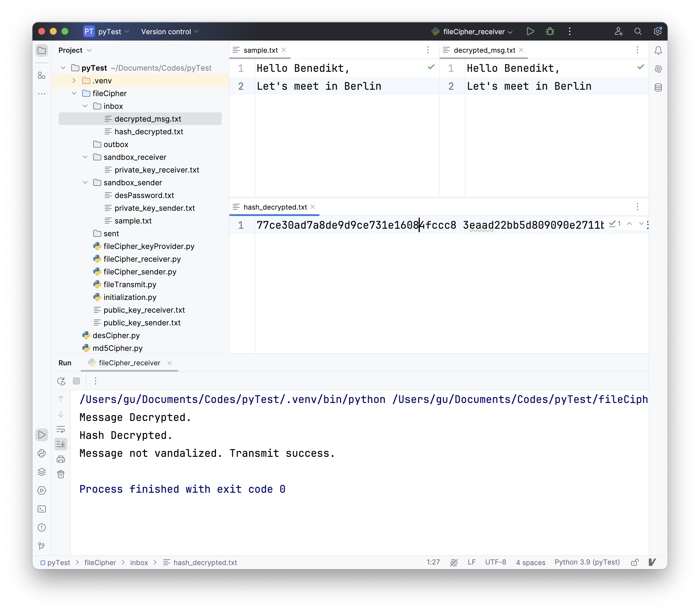

# 应用密码学与网络安全实验报告
## 实验一 古典密码实验
**实验目的**：了解并掌握Caesar密码、仿射密码和单表置换密码的加解密原理。
### Caesar密码
自选语言设计Caesar算法，并能任意指定英文字母组合和密钥对前者进行加密。
#### 实验原理
Caesar加密/解密是一种替换加密技术，明文中的所有字母都在字母表上向后（或向前）按照一个固定数目进行偏移后被替换成密文。例如，当偏移量是3的时候，明密文对照表可以如下所示：
<table>
  <tr>
    <td>明文</td><td>ABCDEFGHIJKLMNOPQRSTUVWXYZ</td>
  </tr>
  <tr>
    <td>密文</td><td>DEFGHIJKLMNOPQRSTUVWXYZABC</td>
  </tr>
</table>
这种加密方式非常容易受到选取语言的制约。例如，当对英语体系进行加密时，选择的偏移量显然不能超过25。因此，即使使用唯密文攻击，凯撒密码也是一种非常容易破解的加密方式。

#### 实验代码与运行记录
##### 加密算法
显然根据实验原理中所描述的定义和思路不难得到凯撒密码的加密算法。为了区分英文字母的大小写，大写字母的加密结果会变为小写，而小写则会被加密为大写。

算法中暗含了一个隐形的“明密文对照表”。英文Caesar密码的解密过程本质上是将密文进行新一轮加密，只是发生了反向的偏移。换言之，加密的偏移量
$k_e$
和解密时的偏移量
$k_d$
在处理英文文本时显然有
$k_d=26-k_e$
。利用此即可通过语言`kotlin`得到如下所示的算法代码。
```kotlin
private fun caesarCipher(text:String, key:Int, decryptMode:Boolean): String {
    val newKey=when(decryptMode){
        true -> 26-key
        else -> key
    }
    val textChars=text.toCharArray()
    val ansChars=CharArray(textChars.size)
    for(i in textChars.indices){
        if(textChars[i] in 'A'..'Z'){
            ansChars[i] = ((textChars[i].code-'A'.code+newKey)%26+'a'.code).toChar()
        }
        else if(textChars[i] in 'a'..'z'){
            ansChars[i] = ((textChars[i].code-'a'.code+newKey)%26+'A'.code).toChar()
        }
        else{
            ansChars[i]=textChars[i]
        }
    }
    return String(ansChars)
}
```

##### 运行结果

对该算法代码设计主程序的输入、输出。随后运行该程序；以加密时偏移量为5，并对文本“`Hello`”进行加密的情况为例，运行结果如下所示。

</img>

</img>

显然解密结果与原本的明文一致。

### 仿射密码

自选语言设计算法，使该算法能够对任意英文字母组合和密钥进行仿射加密。

#### 实验原理

仿射密码本质上与Caesar密码类似，也是一种替代加密技术。对总字母数量为
$m$
的语言体系中的任意字母
$x$
，其加密后的结果
$e(x)$
满足
$e(x)=ax+b\pmod{m}$
，其中
$a$
是与
$m$
互质的任意值，
$b$
是任意值。

与加密函数相对应地，解密函数为
$d(x)=a^{-1}(x-b)\pmod{m}$
，其中
$a^{-1}$
是
$a$
的一个取模倒数。

显然可以通过等式

$$
\begin{align}
\mbox{D}(\mbox{E}(x)) &= a^{-1}(\mbox{E}(x)-b)\mod{m}\\
  &= a^{-1}(((ax+b)\mod{m})-b)\mod{m} \\
  &= a^{-1}(ax+b-b)\mod{m} \\
  &= a^{-1}ax \mod{m}\\
  &= x\mod{m}.
\end{align}
$$

证明加密结果的解密结果就是原文本身。

#### 实验代码与运行记录

##### 算法代码

根据上方定义不难得到仿射加解密的算法。在讨论算法之前，首先要对算法中等式的一部分参数进行设计。

###### 互质

需要确保
$a$
与
$m$
互质。

```kotlin
private fun isPrior(a:Int,b:Int):Boolean{
    if(a==1||b==1) return true
    var realA=a
    var realB=b
    while(true)
    {
        val t = realA % realB
        if(t == 0)
        {
            break
        }
        else
        {
            realA = realB
            realB = t
        }
    }
    return realB <= 1
}
```

###### 取模倒数（乘法逆元）

生成
$a$
的取模倒数
$a^{-1}$
；此值应能确保与
$a$
的乘积对
$m$
的求余结果为1。

```kotlin
private fun inverseGenerator(a:Int,m:Int):Int{
    var result=0
    var i=0
    do{
        i++
        if(a*i%m==1){
            result=i
            break
        }
    }while(true)
    return result
}
```

###### 加密

由于是英文字母分大小写总共52个，故不妨令
$m=53$
。在这之后先生成一个暗含的明密文对照表`cipherSheet`，再根据此表通过`ReferenceForIndex`对每一个给定的字符查找到该字符在表中所对应的索引；类似地，再通过`cipherSheetReferenceForChar`可以找到特定索引号在表内所对应的字符。之后根据上述所有函数利用定义即可用`kotlin`写出算法代码如下所示。

```kotlin
private val cipherSheet=CharArray(55)

private fun cipherSheetReferenceForIndex(c:Char):Int{
    if(c in 'a'..'z') return c.code-'a'.code+1
    if(c in 'A'..'Z') return c.code-'A'.code+27
    return -1
}
private fun cipherSheetReferenceForChar(i:Int):Char{
    return cipherSheet[i]
}
private fun affineCipher(text:String,a:Int,b:Int,m:Int,decryptMode:Boolean):String{
    for(i in 0 until 26){
        cipherSheet[i+1]=(i+'a'.code).toChar()
        cipherSheet[i+27]=(i+'A'.code).toChar()
    }
    val textChars=text.toCharArray()
    val ansChars=CharArray(textChars.size)
    for(i in text.indices){
        val n = cipherSheetReferenceForIndex(text[i])
        if(n!=-1){
            val index = when(decryptMode) {
                true->(inverseGenerator(a,m) * (n - b + m)) % m
                else->(a*n+b)%m
            }
            ansChars[i]=cipherSheetReferenceForChar(index)
        }
        else{
            ansChars[i]=textChars[i]
        }
    }
    return String(ansChars)
}
```

##### 运行结果

根据算法代码设计输入输出，并运行该程序。以利用
$a=91,b=2$
对明文“`Hello`”进行加解密为例，得到的结果如下所示：

</img>

</img>

可以看到，解密的结果与原本的明文一致。

### 单表置换加密

自选语言设计算法，使该算法可以对文本进行单表置换加解密。

#### 实验原理

单表置换加密本质上是一种置换式加密；与替代式加密的不同之处在于，其可以通过打乱明文（通常是字符或字符组）中的各字符所处的相对位置而实现加密，并在打乱后生成文本密文。在没有密钥的情况下，生成的消息极难破译，因为字符有意义的排列方式可以有很多种。

单表置换加密算法中维护着一个置换表，其中记录了明文和密文的对照关系。在没有加密（即没有发生置换）之前，其置换表可以如下。

<table>
  <tr>
    <td>明文</td><td>a</td><td>b</td><td>c</td><td>d</td><td>e</td><td>f</td><td>g</td><td>h</td><td>i</td><td>j</td><td>k</td><td>l</td><td>m</td>
  </tr>
  <tr>
    <td>密文</td><td>a</td><td>b</td><td>c</td><td>d</td><td>e</td><td>f</td><td>g</td><td>h</td><td>i</td><td>j</td><td>k</td><td>l</td><td>m</td>
  </tr>
  <tr>
    <td>明文</td><td>n</td><td>o</td><td>p</td><td>q</td><td>r</td><td>s</td><td>t</td><td>u</td><td>v</td><td>w</td><td>x</td><td>y</td><td>z</td>
  </tr>
  <tr>
    <td>密文</td><td>n</td><td>o</td><td>p</td><td>q</td><td>r</td><td>s</td><td>t</td><td>u</td><td>v</td><td>w</td><td>x</td><td>y</td><td>z</td>
  </tr>
  <tr>
    <td>明文</td><td>A</td><td>B</td><td>C</td><td>D</td><td>E</td><td>F</td><td>G</td><td>H</td><td>I</td><td>J</td><td>K</td><td>L</td><td>M</td>
  </tr>
  <tr>
    <td>密文</td><td>A</td><td>B</td><td>C</td><td>D</td><td>E</td><td>F</td><td>G</td><td>H</td><td>I</td><td>J</td><td>K</td><td>L</td><td>M</td>
  </tr>
  <tr>
    <td>明文</td><td>N</td><td>O</td><td>P</td><td>Q</td><td>R</td><td>S</td><td>T</td><td>U</td><td>V</td><td>W</td><td>X</td><td>Y</td><td>Z</td>
  </tr>
  <tr>
    <td>密文</td><td>N</td><td>O</td><td>P</td><td>Q</td><td>R</td><td>S</td><td>T</td><td>U</td><td>V</td><td>W</td><td>X</td><td>Y</td><td>Z</td>
  </tr>
</table>

在设定密钥为“`Munich`”后，置换表将发生改变；改变后的结果如下。

<table>
  <tr>
    <td>明文</td><td>a</td><td>b</td><td>c</td><td>d</td><td>e</td><td>f</td><td>g</td><td>h</td><td>i</td><td>j</td><td>k</td><td>l</td><td>m</td>
  </tr>
  <tr>
    <td>密文</td><td>m</td><td>u</td><td>n</td><td>i</td><td>c</td><td>h</td><td>a</td><td>b</td><td>d</td><td>e</td><td>f</td><td>g</td><td>j</td>
  </tr>
  <tr>
    <td>明文</td><td>n</td><td>o</td><td>p</td><td>q</td><td>r</td><td>s</td><td>t</td><td>u</td><td>v</td><td>w</td><td>x</td><td>y</td><td>z</td>
  </tr>
  <tr>
    <td>密文</td><td>k</td><td>l</td><td>o</td><td>p</td><td>q</td><td>r</td><td>s</td><td>t</td><td>v</td><td>w</td><td>x</td><td>y</td><td>z</td>
  </tr>
  <tr>
    <td>明文</td><td>A</td><td>B</td><td>C</td><td>D</td><td>E</td><td>F</td><td>G</td><td>H</td><td>I</td><td>J</td><td>K</td><td>L</td><td>M</td>
  </tr>
  <tr>
    <td>密文</td><td>M</td><td>U</td><td>N</td><td>I</td><td>C</td><td>H</td><td>A</td><td>B</td><td>D</td><td>E</td><td>F</td><td>G</td><td>J</td>
  </tr>
  <tr>
    <td>明文</td><td>N</td><td>O</td><td>P</td><td>Q</td><td>R</td><td>S</td><td>T</td><td>U</td><td>V</td><td>W</td><td>X</td><td>Y</td><td>Z</td>
  </tr>
  <tr>
    <td>密文</td><td>K</td><td>L</td><td>O</td><td>P</td><td>Q</td><td>R</td><td>S</td><td>T</td><td>V</td><td>W</td><td>X</td><td>Y</td><td>Z</td>
  </tr>
</table>

比较后不难看出两置换表之间的区别。选用的密钥“`Munich`”将小写字母置换表区域中的`m`、`u`、`n`、`i`、`c`、`h`按密钥中的顺序提前至首位，剩余的未出现在密钥中的字母按字母表顺序排列在小写字母置换表中的剩余位置。大写字母置换表区域与其一致。

#### 实验代码与运行记录

##### 算法代码

和仿射加密类似，算法中暗含了一个加密对照表和一个解密对照表。在加解密的过程中，只要通过对字符查找索引和根据索引查找字符即可实现置换。据此可以通过`kotlin`写出算法如下。

```kotlin
private val encryptSheet= IntArray(30)
private val decryptSheet= IntArray(30)
private fun sheetReferenceForIndex(c:Char):Int{
    if (c in 'a'..'z') return c.code-'a'.code
    return if (c in 'A'..'Z') c.code-'A'.code
    else -1
}
private fun singleTableCipher(text:String,key:String,decryptMode:Boolean):String{
    val flags=IntArray(30){_->0}
    var k=0
    for(i in key.indices){
        var n = sheetReferenceForIndex(key[i])
        if(flags[n] == 0){
            encryptSheet[k++]=n
            decryptSheet[n]=k-1
            flags[n]=1
        }
    }
    for(i in 0..<26){
        if(flags[i] == 0){
            encryptSheet[k++]=i
            decryptSheet[i]=k-1
        }
    }
    val textLen=text.length
    val ansChars=CharArray(textLen)
    for(i in text.indices){
        if(text[i] in 'a' .. 'z') ansChars[i] = (when(decryptMode){
            true->decryptSheet[text[i].code-'a'.code]
            else->encryptSheet[text[i].code-'a'.code]
        }+'a'.code).toChar()
        else if(text[i] in 'A'..'Z') ansChars[i]=(when(decryptMode){
            true->decryptSheet[text[i].code-'A'.code]
            else->encryptSheet[text[i].code-'A'.code]
        }+'A'.code).toChar()
        else ansChars[i]=text[i]
    }
    return String(ansChars)
}
```

##### 运行结果

根据上述算法设计输入输出。以采取密钥“`Munich`”对明文“`Berlin`”进行加解密为例，可以得到运行结果如下所示。

</img>

</img>

显然，解密结果和原本的明文一致。

### 实验心得

古典密码学的各种加密都是通过简单的表内对照或基本运算实现的。也正是因此，这些加密算法都非常容易被破解；只有密钥相对复杂的置换式加密才有可能存在破译难度。

算法的编写过程中完全根据定义就能写出，没有遇到什么困难——这也比较符合这些密码广为使用时的实际场景。

## 实验二 对称密钥加密（DES）实验

**实验目的**：了解并掌握DES加密的基本思路和加密算法。

**实验内容**：自行选取语言编写算法，使该算法在不使用该语言自带的加密库的情况下能够对给定文本进行加解密。

### 实验原理

数据加密标准（英语：Data Encryption Standard，缩写为DES）是一种基于使用56位密钥的对称密钥加密算法，1976年被美国联邦政府的国家标准局确定为联邦资料处理标准（FIPS），随后在国际上受到广泛使用。算法的整体结构中有16次相同的循环处理过程；在主处理这些循环之前，待加密的文本会被分成两个32位的半块后分别处理；这种交叉的方式也被称为Fiestel结构。Fiestel结构保证了加解密过程的相似度，唯一的区别在于子密钥在解密时是应用顺序与加密时相反。

在对这两个32位的半块做处理时主要包含以下四个步骤：

1. **扩张**：用扩张置换将32位的半块扩展到48位，其输出包括8个6位的块，每块包含4位对应的输入位，加上两个邻接的块中紧邻的位。
2. **密钥混合**：用异或操作将扩张的结果和16个48位的子密钥中的每一个进行混合；这些子密钥都是利用密钥调度从主密钥生成的。
3. **S盒**：在与子密钥混合之后，块被分成8个6位的块，然后使用“S盒”（或称“置换盒”）进行处理。8个S盒的每一个都使用以查找表方式提供的非线性的变换将它的6个输入位变成4个输出位。
4. **置换**：将S盒的32个输出位利用固定的“P置换”进行重组，从而将每个S盒的4位输出在下一次循环中的扩张步骤时使用4个不同的S盒进行处理。

在上方密钥混合步骤中所提到的“密钥调度”主要先使用选择置换1（PC-1）从64位输入密钥中选出56位的密钥。剩下的8位要么直接丢弃，要么作为奇偶校验位。然后，56位分成两个28位的半密钥；每个半密钥接下来都被分别处理。在接下来的每次循环中，两个半密钥都被左移1或2位（由循环次数数决定），然后通过选择置换2（PC-2）产生48位的子密钥——每个半密钥24位。移位表明每个子密钥中使用了不同的位；每个位大致在16个子密钥出现14次。

处理之后将结果与另一个半块异或。在此之后将得到的结果与原本的半块组合并交换顺序，进入下一次循环。在最后一次循环完成时，两个半块需要交换顺序。

### 实验代码与运行结果

#### 算法代码

根据上述定义利用`python`语言作代码如下。

```python
import time

# 淫趴矩阵（imperative matrix）
# 这些矩阵使用时下标要减一
# IP置换作用于进行16轮f函数作用之前，IP逆置换作用于16轮f函数作用之后
# IP置换表

IP_table = [58, 50, 42, 34, 26, 18, 10, 2,
            60, 52, 44, 36, 28, 20, 12, 4,
            62, 54, 46, 38, 30, 22, 14, 6,
            64, 56, 48, 40, 32, 24, 16, 8,
            57, 49, 41, 33, 25, 17, 9, 1,
            59, 51, 43, 35, 27, 19, 11, 3,
            61, 53, 45, 37, 29, 21, 13, 5,
            63, 55, 47, 39, 31, 23, 15, 7
            ]
# 逆IP置换表
_IP_table = [40, 8, 48, 16, 56, 24, 64, 32,
             39, 7, 47, 15, 55, 23, 63, 31,
             38, 6, 46, 14, 54, 22, 62, 30,
             37, 5, 45, 13, 53, 21, 61, 29,
             36, 4, 44, 12, 52, 20, 60, 28,
             35, 3, 43, 11, 51, 19, 59, 27,
             34, 2, 42, 10, 50, 18, 58, 26,
             33, 1, 41, 9, 49, 17, 57, 25
             ]
# 每一个S-盒的输入数据是6位，输出数据是4位，但是每个S-盒自身是64位
# 设入的六位为b1,b2,b3,b4,b5,b6，b1、b6位组合得到列号，b2,b3,b4,b5组合得到行号。
# S盒中的S1盒
S1 = [14, 4, 13, 1, 2, 15, 11, 8, 3, 10, 6, 12, 5, 9, 0, 7,
      0, 15, 7, 4, 14, 2, 13, 1, 10, 6, 12, 11, 9, 5, 3, 8,
      4, 1, 14, 8, 13, 6, 2, 11, 15, 12, 9, 7, 3, 10, 5, 0,
      15, 12, 8, 2, 4, 9, 1, 7, 5, 11, 3, 14, 10, 0, 6, 13
      ]
# S盒中的S2盒
S2 = [15, 1, 8, 14, 6, 11, 3, 4, 9, 7, 2, 13, 12, 0, 5, 10,
      3, 13, 4, 7, 15, 2, 8, 14, 12, 0, 1, 10, 6, 9, 11, 5,
      0, 14, 7, 11, 10, 4, 13, 1, 5, 8, 12, 6, 9, 3, 2, 15,
      13, 8, 10, 1, 3, 15, 4, 2, 11, 6, 7, 12, 0, 5, 14, 9
      ]
# S盒中的S3盒
S3 = [10, 0, 9, 14, 6, 3, 15, 5, 1, 13, 12, 7, 11, 4, 2, 8,
      13, 7, 0, 9, 3, 4, 6, 10, 2, 8, 5, 14, 12, 11, 15, 1,
      13, 6, 4, 9, 8, 15, 3, 0, 11, 1, 2, 12, 5, 10, 14, 7,
      1, 10, 13, 0, 6, 9, 8, 7, 4, 15, 14, 3, 11, 5, 2, 12
      ]
# S盒中的S4盒
S4 = [7, 13, 14, 3, 0, 6, 9, 10, 1, 2, 8, 5, 11, 12, 4, 15,
      13, 8, 11, 5, 6, 15, 0, 3, 4, 7, 2, 12, 1, 10, 14, 9,
      10, 6, 9, 0, 12, 11, 7, 13, 15, 1, 3, 14, 5, 2, 8, 4,
      3, 15, 0, 6, 10, 1, 13, 8, 9, 4, 5, 11, 12, 7, 2, 14
      ]
# S盒中的S5盒
S5 = [2, 12, 4, 1, 7, 10, 11, 6, 8, 5, 3, 15, 13, 0, 14, 9,
      14, 11, 2, 12, 4, 7, 13, 1, 5, 0, 15, 10, 3, 9, 8, 6,
      4, 2, 1, 11, 10, 13, 7, 8, 15, 9, 12, 5, 6, 3, 0, 14,
      11, 8, 12, 7, 1, 14, 2, 13, 6, 15, 0, 9, 10, 4, 5, 3
      ]
# S盒中的S6盒
S6 = [12, 1, 10, 15, 9, 2, 6, 8, 0, 13, 3, 4, 14, 7, 5, 11,
      10, 15, 4, 2, 7, 12, 9, 5, 6, 1, 13, 14, 0, 11, 3, 8,
      9, 14, 15, 5, 2, 8, 12, 3, 7, 0, 4, 10, 1, 13, 11, 6,
      4, 3, 2, 12, 9, 5, 15, 10, 11, 14, 1, 7, 6, 0, 8, 13
      ]
# S盒中的S7盒
S7 = [4, 11, 2, 14, 15, 0, 8, 13, 3, 12, 9, 7, 5, 10, 6, 1,
      13, 0, 11, 7, 4, 9, 1, 10, 14, 3, 5, 12, 2, 15, 8, 6,
      1, 4, 11, 13, 12, 3, 7, 14, 10, 15, 6, 8, 0, 5, 9, 2,
      6, 11, 13, 8, 1, 4, 10, 7, 9, 5, 0, 15, 14, 2, 3, 12
      ]
# S盒中的S8盒
S8 = [13, 2, 8, 4, 6, 15, 11, 1, 10, 9, 3, 14, 5, 0, 12, 7,
      1, 15, 13, 8, 10, 3, 7, 4, 12, 5, 6, 11, 0, 14, 9, 2,
      7, 11, 4, 1, 9, 12, 14, 2, 0, 6, 10, 13, 15, 3, 5, 8,
      2, 1, 14, 7, 4, 10, 8, 13, 15, 12, 9, 0, 3, 5, 6, 11
      ]
# S盒；将8个S盒组成一个8行64列的2维数组
S = [S1, S2, S3, S4, S5, S6, S7, S8]
# P盒置换将每一位输入位映射到输出位。任何一位都不能被映射两次，也不能被略去。
# P盒
P_table = [16, 7, 20, 21,
           29, 12, 28, 17,
           1, 15, 23, 26,
           5, 18, 31, 10,
           2, 8, 24, 14,
           32, 27, 3, 9,
           19, 13, 30, 6,
           22, 11, 4, 25
           ]
# 压缩置换表1，不考虑每字节的第8位，将64位密钥减至56位。然后进行一次密钥置换。
# 忽略第8位奇偶校验的同时，进行置换，
compressed_table1 = [57, 49, 41, 33, 25, 17, 9,
                1, 58, 50, 42, 34, 26, 18,
                10, 2, 59, 51, 43, 35, 27,
                19, 11, 3, 60, 52, 44, 36,
                63, 55, 47, 39, 31, 23, 15,
                7, 62, 54, 46, 38, 30, 22,
                14, 6, 61, 53, 45, 37, 29,
                21, 13, 5, 28, 20, 12, 4
                ]

# 压缩置换表2，用于将循环左移和右移后的56bit密钥压缩为48bit
# 完成左移和右移后
# 去掉第9、18、22、25、35、38、43、54位，从56位变成48位，再按表的位置置换。
compressed_table2 = [14, 17, 11, 24, 1, 5,
                3, 28, 15, 6, 21, 10,
                23, 19, 12, 4, 26, 8,
                16, 7, 27, 20, 13, 2,
                41, 52, 31, 37, 47, 55,
                30, 40, 51, 45, 33, 48,
                44, 49, 39, 56, 34, 53,
                46, 42, 50, 36, 29, 32
                ]

# 扩展置换改变了位的次序，重复了某些位
# 用于对数据进行扩展置换，将32bit数据扩展为48bit
# 目的A:产生与秘钥相同长度的数据以进行异或运算，R0是32位，子秘钥是48位，
# 目的B:提供更长的结果，使得在替代运算时能够进行压缩。
extend_table = [32, 1, 2, 3, 4, 5,
                4, 5, 6, 7, 8, 9,
                8, 9, 10, 11, 12, 13,
                12, 13, 14, 15, 16, 17,
                16, 17, 18, 19, 20, 21,
                20, 21, 22, 23, 24, 25,
                24, 25, 26, 27, 28, 29,
                28, 29, 30, 31, 32, 1
                ]


# --------------------------从字符到bit--------------------------
# 将字符转换为对应的Unicode码，中文用2个字节表示
def char2unicode_ascii(toBeProcessed, length):
    result = []
    for i in range(length):
        # ord是chr()的及配对函数，以‘c’“c”做为参数
        # 返回对应的ASCII或Unicode数值，若超出，返回TypeError
        result.append(ord(toBeProcessed[i]))
    return result


# 将Unicode码转为bit
def unicode2bit(toBeProcessed, length):
    resultBit = []
    for i in range(length * 16):
        # 每一位Unicode都是16bit组成
        # 2bProcessed[int(i/16)]length*16:对应待处理文本中的每一个Unicode，进行16次操作
        # 每轮操作右移0,1,2...,15位，然后与1且运算，一次得到16bit
        # ！！！得到的这16位resultBit是个逆序
        resultBit.append(toBeProcessed[int(i / 16)] >> (i % 16) & 1)
    return resultBit


# 将8位ASCII码转为bit
def byte2bit(charToBeProcessed, length):
    resultBit = []
    for i in range(length * 8):
        # 原理同上
        resultBit.append(charToBeProcessed[int(i / 8)] >> (i % 8) & 1)
    return resultBit


# --------------------------从bit到字符--------------------------
# 将bit转为Unicode码
def bit2unicode(bitToBeProcessed, length):
    out = []
    temp = 0
    for i in range(length):
        # 这和上面是同步的，将bit，反着求出，刚刚好
        # 或的运算符在这里相当+，左边是int，右边是int，这里相当于二进制数，妙
        # 每16位bit，对应着一位Unicode，
        # 所以当i对16求模，余数为15时
        # 将append(temp),并且重新设置temp为0
        temp = temp | (bitToBeProcessed[i] << (i % 16))
        if i % 16 == 15:
            out.append(temp)
            temp = 0
    return out


# 将bit转为ascii码
def bit2byte(bitToBeProcessed, length):
    out = []
    temp = 0
    for i in range(length):
        temp = temp | (bitToBeProcessed[i] << (i % 8))
        if i % 8 == 7:
            out.append(temp)
            temp = 0
    return out


# 将unicode码转为字符（中文或英文）
def unicode2char(byteToBeProcessed, length):
    out = ""
    for i in range(length):
        out = out + chr(byteToBeProcessed[i])
    return out


# ------------------生成每一轮的key------------------
def createKeys(keyToBeProcessed):
    keyResult = []
    # 将char型秘钥转化为bit型
    key_ascii_ver = char2unicode_ascii(keyToBeProcessed, len(keyToBeProcessed))
    initialKey = byte2bit(key_ascii_ver, len(key_ascii_ver))
    # print("initialKey = ", end = '')
    # print(initialKey)
    # 用0初始化列表key0，key1,
    key0 = [0 for i in range(56)]
    key1 = [0 for i in range(48)]
    # 进行密码压缩置换1，
    # 用压缩置换表1，不考虑每字节的第8位，
    # 将64位密码压缩为56位
    for i in range(56):
        key0[i] = initialKey[compressed_table1[i] - 1]

    # 进行16轮的密码生成
    for i in range(16):
        # ---------------确定左移的次数---------------
        if i == 0 or i == 1 or i == 8 or i == 15:
            movestep = 1
        else:
            movestep = 2
        # --------------------------------------------

        # -----分两部分，每28bit位一部分，进行循环左移-----
        # 因为每次循环左移就是第28个移动至第1个
        for j in range(movestep):
            # 以行为单位
            # 移动2位就是，移动一位进行2次操作
            '''
            for k in range(8):
                #以行为单位左移
                #除去最后一位，每一行都左移一位，操作前保留第一位
                temp = key0[k*7]
                for m in range(7*k, 7*k + 6):
                    key0[m] = key0[m+1]
                key0[7*k + 6] = temp
            '''
            # 以组为单位左移
            temp = key0[0]
            for k in range(27):
                key0[k] = key0[k + 1]
            key0[27] = temp
            temp = key0[28]
            for k in range(28, 55):
                key0[k] = key0[k + 1]
            key0[55] = temp
        # -----------------------------------------------

        # -------对56位密钥进行压缩置换，压缩为48位--------
        # 置换选择表2(PC-2)，得到子密匙K1
        for k in range(48):
            key1[k] = key0[compressed_table2[k] - 1]
        # keyResult为16行48列的二维数组
        keyResult.extend(key1)
        # -------------------------------------------------

    return keyResult


'''
# 用来检验代码
key0 = [57,49,41,33,25,17,9,
        1,58,50,42,34,26,18,
        10,2,59,51,43,35,27,
        19,11,3,60,52,44,36,
        63,55,47,39,31,23,15,
        7,62,54,46,38,30,22,
        14,6,61,53,45,37,29,
        21,13,5,28,20,12,4]


# 以组为单位左移
temp = key0[0]
for k in range(27):
    key0[k] = key0[k+1]
key0[27] = temp
temp = key0[28]
for k in range(28, 55):
    key0[k] = key0[k+1]
key0[55] = temp
key0
'''


def DES(text, key, optionType):
    keyResult = createKeys(key)
    # 初始化最终得到的结果
    finalTextOfBit = [0 for i in range(64)]
    finalTextOfUnicode = [0 for i in range(4)]

    # 打印出来检验一下
    # print(keyResult)

    if optionType == 0:
        # 初始化
        # 用于临时盛放IP拟置换前，将L部分和R部分合成64的结果
        tempText = [0 for i in range(64)]

        # 初始化
        # 用于盛放R部分的扩展到48位的结果
        extendR = [0 for i in range(48)]

        # char型向bit型转化
        unicodeText = char2unicode_ascii(text, len(text))
        # print(unicodeText)
        bitText = unicode2bit(unicodeText, len(unicodeText))
        # print(bitText)

        # 初始化
        # 用于存放IP置换之后的结果
        initTrans = [0 for i in range(64)]

        # ---------------进行初始IP置换---------------
        for i in range(64):
            initTrans[i] = bitText[IP_table[i] - 1]
        # 将64位明文分为左右两部分

        L = initTrans[:32]
        R = initTrans[32:]

        # 开始进行16轮运算
        for i in range(16):
            # 临时存放R
            tempR = R

            # -------对R进行扩展，将32位扩展为48位-------
            for j in range(48):
                extendR[j] = R[extend_table[j] - 1]
            # print(len(keyResult))

            # 第i轮的秘钥，从keyResult中取出
            key_i = [keyResult[j] for j in range(i * 48, i * 48 + 48)]
            # print(i,key_i)
            # ---------与key进行异或运算--------
            # 初始化
            XORResult = [0 for j in range(48)]
            for j in range(48):
                if key_i[j] != extendR[j]:
                    XORResult[j] = 1
            # ----------------------------------

            # ---------开始进行盒运算----------
            # 初始化
            SResult = [0 for k in range(32)]
            for k in range(8):
                # 此处使用移位转进制
                row = ((XORResult[k * 6]) << 1) | (XORResult[k * 6 + 5])
                column = 0
                for j in range(1, 5):
                    column = column | (XORResult[k * 6 + j] << (4 - j))
                temp = S[k][row * 16 + column]
                for m in range(4):
                    SResult[k * 4 + m] = (temp >> m) & 1
            # ---------------------------------
            # if i == 0:
            #    print('PResult is :;；：',PResult)

            # -------------开始进行P盒置换-------------
            # 初始化
            PResult = [0 for k in range(32)]
            for k in range(32):
                PResult[k] = SResult[P_table[k] - 1]
            # -----------------------------------------
            # if i == 0:
            # print('PRsult is :;；：',PResult)
            # --------------与L部分的数据进行异或------------
            XORWithL = [0 for k in range(32)]
            for k in range(32):
                if L[k] != PResult[k]:
                    XORWithL[k] = 1
            # ----------------------------------------------

            # 将临时保存的R部分值，即tempR复制给L
            L = tempR
            R = XORWithL

            # print("当前i为%d",(i))
            # print("当前L,R为",L,R)
            # -----------------循环结束-----------------

        # 交换左右两部分
        L, R = R, L
        # if i == 0:
        #    print('LRis :;；：',L,R)
        # 合并为一部分
        tempText = L
        tempText.extend(R)

        # IP逆置换
        for k in range(64):
            finalTextOfBit[k] = tempText[_IP_table[k] - 1]

        # bit型转化为char型
        finalTextOfUnicode = bit2byte(finalTextOfBit, len(finalTextOfBit))
        # print(finalTextOfUnicode)
        # print("finalTextOfUnicode", finalTextOfUnicode)
        finalTextOfChar = unicode2char(finalTextOfUnicode, len(finalTextOfUnicode))
        return finalTextOfChar
    else:
        # 初始化
        # 用于临时盛放IP拟置换前，将L部分和R部分合成64的结果
        tempText = [0 for i in range(64)]

        # 初始化
        # 用于盛放R部分的扩展到48位的结果
        extendR = [0 for i in range(48)]

        # char型向bit型转化
        unicodeText = char2unicode_ascii(text, len(text))
        # print(unicodeText)
        bitText = byte2bit(unicodeText, len(unicodeText))
        # print(bitText)

        # 初始化
        # 用于存放IP置换之后的结果
        initTrans = [0 for i in range(64)]

        # ---------------进行初始IP置换---------------
        for i in range(64):
            initTrans[i] = bitText[IP_table[i] - 1]
        # 将64位明文分为左右两部分
        L = [initTrans[i] for i in range(32)]
        R = [initTrans[i] for i in range(32, 64)]

        # 开始进行16轮运算
        for i in range(15, -1, -1):
            # 临时存放R
            tempR = R

            # -------对R进行扩展，将32位扩展为48位-------
            for j in range(48):
                extendR[j] = R[extend_table[j] - 1]
            # print(len(keyResult))

            # 第i轮的秘钥，从keyResult中取出
            key_i = [keyResult[j] for j in range(i * 48, i * 48 + 48)]
            # ---------与key进行异或运算--------
            # 初始化
            XORResult = [0 for j in range(48)]
            for j in range(48):
                if key_i[j] != extendR[j]:
                    XORResult[j] = 1
            # ----------------------------------

            # ---------开始进行S盒运算----------
            # 初始化
            SResult = [0 for k in range(32)]

            for k in range(8):
                # 此处使用移位转进制
                row = (XORResult[k * 6] << 1) | (XORResult[k * 6 + 5])
                column = 0
                for j in range(1, 5):
                    column = column | (XORResult[k * 6 + j] << (4 - j))
                temp = S[k][row * 16 + column]
                for m in range(4):
                    SResult[k * 4 + m] = (temp >> m) & 1
            # ---------------------------------
            # print('SResult',SResult)
            # -------------开始进行P盒置换-------------
            # 初始化
            PResult = [0 for k in range(32)]
            for k in range(32):
                PResult[k] = SResult[P_table[k] - 1]
            # -----------------------------------------

            # --------------与L部分的数据进行异或------------
            XORWithL = [0 for k in range(32)]
            for k in range(32):
                if L[k] != PResult[k]:
                    XORWithL[k] = 1
            # ----------------------------------------------

            # 将临时保存的R部分值，即tempR复制给L
            L = tempR
            R = XORWithL
            # print("L, R在第%d轮",(i, L,R))
        # 交换左右两部分
        L, R = R, L
        # print("L, R",(L,R))
        # 合并为一部分
        tempText = L
        tempText.extend(R)
        # ----------------------IP逆置换----------------------
        for k in range(64):
            finalTextOfBit[k] = tempText[_IP_table[k] - 1]

        # bit型转化为char型
        finalTextOfUnicode = bit2unicode(finalTextOfBit, len(finalTextOfBit))
        # print(finalTextOfUnicode)
        finalTextOfChar = unicode2char(finalTextOfUnicode, len(finalTextOfUnicode))
        # print(finalTextOfChar)
        return finalTextOfChar


```

#### 运行结果

根据上方算法设计输入输出，并运行该程序。以利用八位密钥“`DESCrypt`”加密文本“`Hello DES`”为例，得到加解密情况如下：

</img>

显然解密得到的文本与加密前一致。

### 实验心得

作为一个已经有了完整体系且至今仍受欢迎的加密算法，DES加密算法的代码量非常大。为了降低转码的工作量，选取了中英文字母都占2个字节的Unicode作为文本处理后的第一步。

## 实验三 非对称加密（RSA）实验

**实验目的**：了解并掌握RSA加密算法的原理。

**实验内容**：自行选取语言编写算法，使该算法在不利用该语言自带密码库的情况下能够对文本进行RSA加解密。

### 实验原理

RSA加密算法是一种非对称加密算法，在公开密钥加密和电子商业中被广泛使用。

#### 公私钥
若Alice想要接收Bob的私人訊息，她可以用以下的方式來产生公钥和私钥：

1. 选取任意两个较大且不相等的质数
$p$
和
$q$
，
并计算
$N=pq$
。
2. 根据欧拉函数求
$$r=\varphi (N) = \varphi (p)\times\varphi (q)=(p-1)(q-1)$$
3. 任取一个小于
$r$且与之互质的整数
$e$
，并求
$e$
关于
$r$
的取模倒数
$d$

通过此方法得到的数对
$(N,e)$
即公钥，
$(N,d)$
即私钥。Alice自己保留私钥的同时将公钥发送给Bob即可开始使用非对称算法的加密信息传送。

#### 信息加（解）密
假设Bob想在知晓Alice生成的
$N$
和
$e$
的情况下给Alice发送消息
$m$
，则Bob只需要将
$m$
中的每一个字通过unicode或其他转码方式转换为一个小于
$N$
的非负整数
$n$
，随后通过公式
$$
c = n^e \bmod{N}
$$
将信息
$m$
加密为密文
$c$
，再将
$c$
发送即可。Alice收到消息后解密的方式也类似，只需要利用
$c$
和她的私钥
$d$
通过公式
$$
n = c^d \bmod {N}
$$
得到原文
$n$
即可。

显然可以证明

$$
\begin{align}
c^d \equiv n^{e \cdot d}\ (\mathrm{mod}\ N)

&\equiv <math> n ^ {ed} = n ^ {1 + h \varphi(N)} = n \cdot n ^ {h \varphi(N) } = n \left( n ^ {\varphi(N)} \right) ^ h
\end{align}
$$

若
$n$
与
$N$
互质，则由欧拉定理显然有

$$n ^ {ed} \equiv n \left( n ^ {\varphi(N)} \right) ^ h \equiv n (1) ^ h \equiv n \pmod{N} $$

否则不妨设
$n = ph, ed -1 = k(q-1)$
，进而有

$$ n ^ {ed} = (ph) ^ {ed} \equiv 0 \equiv ph \equiv n \pmod p $$

$$ n ^ {ed} = n ^{ed - 1} n = n^{k(q - 1)} n = (n^{q - 1})^k n \equiv 1^k n \equiv n \pmod{q} $$

故 

$$n ^ {ed} \equiv n \pmod N$$

### 实验代码与运行结果

利用语言`kotlin`编写算法如下。

```kotlin
import kotlin.random.Random

// Functions of Mathematical Methods
private fun euclid4GCDPlus(a: Int, b: Int): Triple<Int, Int, Int> {
    //Extended Euclid Methods are used to search for a solution to the equation ax+by=1.
    return if (b == 0) {
        Triple(1, 0, a)
    } else {
        val (x, y, euclidResult) = euclid4GCDPlus(b, a % b)
        Triple(y, x - (a / b) * y, euclidResult)
    }
}

private fun euclid4GCD(a: Int, b: Int): Int {
    //Euclid Methods are employed to find the greatest common divisor of 2 numbers
    return if (a % b == 0) {
        b
    } else {
        euclid4GCD(b, a % b)
    }
}

private fun montgomeryModularMultiplication4Mod(base: Int, exponent: Int, n: Int): Int {
    //Montgomery Modular Multiplication Methods are applied for calculate the mod for an exponential number.
    val binArray = exponent.toString(2).reversed()
    val r = binArray.length
    val baseArray = mutableListOf<Int>()
    var preBase = base
    baseArray.add(preBase)
    repeat(r - 1) {
        val nextBase = (preBase * preBase) % n
        baseArray.add(nextBase)
        preBase = nextBase
    }
    var result = 1
    for (i in baseArray.indices) {
        if (binArray[i] == '0') {
            continue
        }
        result *= baseArray[i]
        result %= n
    }
    return result % n
}

//Functions for cipher
private fun keyPairGenerator(p: Int, q: Int): Pair<Pair<Int, Int>, Pair<Int, Int>> {
    val n = p * q
    val phi = (p - 1) * (q - 1)
    //Private key
    var prK = Random.nextInt(2, phi)
    //Public key
    var puK = 0
    while (puK == 0) {
        if (euclid4GCD(prK, phi) == 1) {
            puK = euclid4GCDPlus(prK, phi).first % phi
        } else {
            prK = Random.nextInt(2, phi)
        }
    }
    return Pair(Pair(n, prK), Pair(n, puK))
}

private fun isPrime(n: Int): Boolean {
    if (n <= 1) {
        return false
    }
    for (i in 2..n / 2) {
        if (n % i == 0) {
            return false
        }
    }
    return true
}

private class RSACipher(keyPair: Pair<Int, Int>) {
    val n = keyPair.first
    val key = keyPair.second
    fun encrypt(c: List<Int>): List<Int> {
        return c.map { montgomeryModularMultiplication4Mod(it, key, n) }
    }

    fun decrypt(e: List<Int>): List<Int> {
        return e.map { montgomeryModularMultiplication4Mod(it, key, n) }
    }
}

private fun encode2Integer(text: String): List<Int> {
    return text.map { it.code }
}

private fun decode2Character(list: List<Int>): String {
    return list.map { it.toChar() }.joinToString("")
}

private fun randomPrimeGenerator(x: Int): Int {
    val newNum = Random.nextInt(x)
    return if (isPrime(newNum)) {
        newNum
    } else {
        randomPrimeGenerator(x)
    }
}
```

根据上述代码设计输入输出如下。

```kotlin
private fun main() {
    //Prime Number Prompt
    println("Please select 2 PRIME numbers for key pair generation.")
    print("First PRIME number: ")
    var p = readln().toInt()
    print("Second PRIME number: ")
    var q = readln().toInt()
    println("Confirmed. p = $p, q = $q")
    //Prime check
    println("Checking whether p & q are PRIME...")
    if (isPrime(p) && isPrime(q)) {
        println("Checked: BOTH PRIME")
    } else if (isPrime(q)) {
        println("Checked: p is NOT PRIME")
        p = randomPrimeGenerator(p)
        println("Correction：p has been changed to be a PRIME.")
    } else if (isPrime(p)) {
        println("Checked: q is NOT PRIME")
        q = randomPrimeGenerator(q)
        println("Correction: q has been changed to be a PRIME.")
    } else {
        println("Checked: NO PRIMES")
        p = randomPrimeGenerator(p)
        q = randomPrimeGenerator(q)
        println("Correction: p and q has been changed to be PRIME.")
    }
    println("Check finished. (p = $p, q = $q)")
    val (privateKeyPair, publicKeyPair) = keyPairGenerator(p, q)
    val encryptService = RSACipher(privateKeyPair)
    val decryptService = RSACipher(publicKeyPair)
    print("Enter text to be processed: ")
    val message = readln()
    println("Gotcha. Transcode in progress.")
    Thread.sleep(1000)
    val transcodeText = encode2Integer(message)
    println("Transcode finished: $transcodeText")
    if (transcodeText.max() > p * q) {
        println("WARNING: p & q is not great enough. The result may NOT be correct.")
    }
    println("Encryption in progress.")
    Thread.sleep(1000)
    val encryptedCodeList = encryptService.encrypt(transcodeText)
    println("Encryption done: $encryptedCodeList")
    val decodedEncrypt = decode2Character(encryptedCodeList)
    println("Which can be translated into text: $decodedEncrypt")
    if (encryptedCodeList.max() > p * q) {
        println("WARNING: p & q is not great enough. The result may NOT be correct.")
    }
    println("Decryption in progress.")
    val decryptedCodeList = decryptService.decrypt(encryptedCodeList)
    println("Decryption done: $decryptedCodeList")
    val decodedDecrypt = decode2Character(decryptedCodeList)
    println("Decryption done: $decodedDecrypt")
    println("<Private Key Pair: $privateKeyPair, Public Key Pair: $publicKeyPair>")
}
```

运行该程序。以利用质数41、281加密明文“`Hello RSA`”为例，运行结果如下图所示：



显然解密结果与原文一致。

### 实验心得

根据RSA实验原理定义，对极大整数做因数分解的难度决定了RSA算法的可靠性——对一极大整数做因数分解愈困难，RSA算法愈可靠；如若后期有人能够找到一种快速分解质因数的算法，那么用RSA加密的信息的可靠性就会骤降。

## 实验四 MD5加密实验

**实验目的**：了解并掌握哈希加密算法的工作方式。

**实验内容**：自行选择语言编写算法，使该算法在不利用该语言自带密码库的情况下可以实现对文本的MD5加密。

### 实验原理

MD5消息摘要算法是一种被广泛使用的密码散列函数，可以通过求余、调整长度等方式产生一个特定长度的的散列值来确定信息传输始末内容的完整性和一致性。经过程序流程，MD5加密算法可以生成四个32位数据，最后联合起来成为一个128-bits散列。

$$F(X,Y,Z) = (X\wedge{Y}) \vee (\neg{X} \wedge{Z})$$

$$G(X,Y,Z) = (X\wedge{Z}) \vee (Y \wedge \neg{Z})$$

$$H(X,Y,Z) = X \oplus Y \oplus Z$$

$$I(X,Y,Z) = Y \oplus (X \vee \neg{Z})$$

### 实验代码与加密结果

通过`python`编写的加密程式如下所示。

```python
import math

# 定义常量，用于初始化128位变量，注意字节顺序，文中的A=0x01234567，这里低值存放低字节，即01 23 45 67，所以运算时A=0x67452301，其他类似。
# 这里用字符串的形势，是为了和hex函数的输出统一，hex(10)输出为'0xA',注意结果为字符串。
hexStrA = '0x67452301'
hexStrB = '0xefcdab89'
hexStrC = '0x98badcfe'
hexStrD = '0x10325476'
# 定义每轮中用到的函数。L为循环左移，注意左移之后可能会超过32位，所以要和0xffffffff做与运算，确保结果为32位。
F = lambda x, y, z: ((x & y) | ((~x) & z))
G = lambda x, y, z: ((x & z) | (y & (~z)))
H = lambda x, y, z: (x ^ y ^ z)
I = lambda x, y, z: (y ^ (x | (~z)))
L = lambda x, n: (((x << n) | (x >> (32 - n))) & 0xffffffff)

# 定义每轮中循环左移的位数，这里用4个元组表示,用元组是因为速度比列表快。
shi_1 = (7, 12, 17, 22) * 4
shi_2 = (5, 9, 14, 20) * 4
shi_3 = (4, 11, 16, 23) * 4
shi_4 = (6, 10, 15, 21) * 4

# 定义每轮中用到的M[i]次序。
m_1 = (0, 1, 2, 3, 4, 5, 6, 7, 8, 9, 10, 11, 12, 13, 14, 15)
m_2 = (1, 6, 11, 0, 5, 10, 15, 4, 9, 14, 3, 8, 13, 2, 7, 12)
m_3 = (5, 8, 11, 14, 1, 4, 7, 10, 13, 0, 3, 6, 9, 12, 15, 2)
m_4 = (0, 7, 14, 5, 12, 3, 10, 1, 8, 15, 6, 13, 4, 11, 2, 9)


# 定义函数，用来产生常数T[i]，常数有可能超过32位，同样需要&0xffffffff操作。注意返回的是十进制的数。
def constantGenerator(i):
    result = (int(4294967296 * abs(math.sin(i)))) & 0xffffffff
    return result


# 定义函数，用来将列表中的元素循环右移。原因是在每轮操作中，先运算A的值，然后是D，C，B，16轮之后右恢复原来顺序，所以只要每次操作第一个元素即可。
def shift(shift_list):
    shift_list = [shift_list[3], shift_list[0], shift_list[1], shift_list[2]]
    return shift_list


# 定义主要的函数，参数为当做种子的列表，每轮用到的F，G，H，I，生成的M[]，以及循环左移的位数。该函数完成一轮运算。
def md5Cipher(fun_list, f, m, shi):
    count = 0
    global constantGeneratorApplicationTimeCount
    # 引入全局变量，T(i)是从1到64循环的。
    while count < 16:
        xx = int(fun_list[0], 16) + f(int(fun_list[1], 16), int(fun_list[2], 16), int(fun_list[3], 16)) + int(m[count],
                                                                                                              16) + constantGenerator(
            constantGeneratorApplicationTimeCount)
        xx = xx & 0xffffffff
        ll = L(xx, shi[count])
        # fun_list[0] = hex((int(fun_list[1],16) + ll)&(0xffffffff))[:-1]
        fun_list[0] = hex((int(fun_list[1], 16) + ll) & 0xffffffff)
        # 最后的[:-1]是为了去除类似'0x12345678L'最后的'L'
        fun_list = shift(fun_list)
        count += 1
        constantGeneratorApplicationTimeCount += 1
        # print(fun_list)
    return fun_list


# 该函数生成每轮需要的M[]，最后的参数是为了当有很多分组时，进行偏移。
def m16Generator(order, ascii_list, f_offset):
    ii = 0
    m16 = [0] * 16
    f_offset = f_offset * 64
    for i in order:
        i = i * 4
        m16[ii] = '0x' + ''.join((ascii_list[i + f_offset] + ascii_list[i + 1 + f_offset] + ascii_list[
            i + 2 + f_offset] + ascii_list[i + 3 + f_offset]).split('0x'))
        ii += 1
    for c in m16:
        ind = m16.index(c)
        m16[ind] = reverse_hex(c)
    return m16


# 翻转十六进制数的顺序：'0x01234567' => '0x67452301'
def reverse_hex(hex_str):
    hex_str = hex_str[2:]
    hex_str_list = []
    for i in range(0, len(hex_str), 2):
        hex_str_list.append(hex_str[i:i + 2])
    hex_str_list.reverse()
    hex_str_result = '0x' + ''.join(hex_str_list)
    return hex_str_result


# 显示结果函数，将最后运算的结果列表进行翻转，合并成字符串的操作。
def show_result(f_list):
    result = ''
    f_list1 = [0] * 4
    for i in f_list:
        f_list1[f_list.index(i)] = reverse_hex(i)[2:]
        result = result + f_list1[f_list.index(i)]
    return result


# 程序主循环
while True:
    abcd_list = [hexStrA, hexStrB, hexStrC, hexStrD]
    constantGeneratorApplicationTimeCount = 1
    input_m = input('MSG>>>')
    # 对每一个输入先添加一个'0x80'，即'10000000'
    ascii_list = list((map(hex, map(ord, input_m))))
    # print('ascii_list:',ascii_list)
    msg_length = len(ascii_list) * 8
    ascii_list.append('0x80')

    # 补充0
    while (len(ascii_list) * 8 + 64) % 512 != 0:
        ascii_list.append('0x00')

    # 最后64为存放消息长度，注意长度存放顺序低位在前。
    # 例如，消息为'a'，则长度为'0x0800000000000000'
    msgLength0x = hex(msg_length)[2:]
    msgLength0x = '0x' + msgLength0x.rjust(16, '0')
    msgLength0xBigOrder = reverse_hex(msgLength0x)[2:]
    msgLength0xList = []
    for i in range(0, len(msgLength0xBigOrder), 2):
        msgLength0xList.append('0x' + msgLength0xBigOrder[i:i + 2])
    ascii_list.extend(msgLength0xList)
    # print  (ascii_list)

    # 对每个分组进行4轮运算
    for i in range(0, len(ascii_list) // 64):
        # 将最初128位种子存放在变量中，
        aa, bb, cc, dd = abcd_list
        # 根据顺序产生每轮M[]列表
        order_1 = m16Generator(m_1, ascii_list, i)
        order_2 = m16Generator(m_2, ascii_list, i)
        order_3 = m16Generator(m_3, ascii_list, i)
        order_4 = m16Generator(m_4, ascii_list, i)
        # 主要四轮运算，注意打印结果列表已经被进行过右移操作！
        abcd_list = md5Cipher(abcd_list, F, order_1, shi_1)
        abcd_list = md5Cipher(abcd_list, G, order_2, shi_2)
        abcd_list = md5Cipher(abcd_list, H, order_3, shi_3)
        abcd_list = md5Cipher(abcd_list, I, order_4, shi_4)
        # 将最后输出与最初128位种子相加，注意，最初种子不能直接使用abcd_list[0]等，因为abcd_list已经被改变
        output_a = hex((int(abcd_list[0], 16) + int(aa, 16)) & 0xffffffff)
        output_b = hex((int(abcd_list[1], 16) + int(bb, 16)) & 0xffffffff)
        output_c = hex((int(abcd_list[2], 16) + int(cc, 16)) & 0xffffffff)
        output_d = hex((int(abcd_list[3], 16) + int(dd, 16)) & 0xffffffff)
        # 将输出放到列表中，作为下一次128位种子
        abcd_list = [output_a, output_b, output_c, output_d]
        # 将全局变量Ti_count恢复，一遍开始下一个分组的操作。
        constantGeneratorApplicationTimeCount = 1
        # 最后调用函数，格式化输出
    print('MD5>>>' + show_result(abcd_list))
    break

```

运行该程序。以加密文本“`hello md5`”为例，得到散列值如下所示：



在其他网站上使用在线md5加密工具，加密同一个文本，得到的散列值与之相同。



因此，编写的算法是正确的。

### 实验心得

MD5作为验证被传输信息完整性和一致性的散列值生成方式，其算法也很难被模仿出来，因此代码量也非常的大。在16进制与10进制数相互转换的时候很容易因为疏忽而错转漏转。

## 实验五 密码学应用·文件加密传输试验

**实验目的**：掌握对称加密、非对称加密和哈希算法生成散列值的使用场景并能灵活应用这三种加密方法。

### 实验内容

自选语言编写代码文件若干，使这些程式在不借助这些语言自带密码库的情况下能够模拟文件的加密传输与解密且保证满足信息传输的诸多基本要求（如不可否认性、完整性等）。标注清楚发送端需要发送的文件和这些文件的产生方式，并说明接收端接收到的文件和之后的处理方式。发送的文件须打包发送。

### 功能实现

根据实验内容主要考虑以下几个方面。加密算法的代码在前文均已提及，为减少篇幅在此不与呈现。

#### 机制

文件传输最经典的应用莫过于电子邮箱。因此类比电子邮箱的操作，可以将收发信两端简单模拟成一个个人电子邮箱中的`sent`（已发送）和`inbox`（收件箱）两个文件夹。注意到实验内容要求对文件进行打包发送，因此考虑电子邮箱中的`outbox`（待发送）文件夹——其将暂时存储加密之后的文件，在所有文件生成完毕后询问用户是否确定发送（类似于邮件的“确认发送倒计时”操作）。完成发送后，`outbox`中的文件将全部转移至`sent`中；如若用户在这一环节取消发送，`outbox`中的所有文件将会被销毁。

```python
## fileTransmit.py ##
import os
import shutil
import time

shutil.rmtree(r'inbox')
os.makedirs('inbox')
willingness = input("Are you sure to send all files in the outbox?\nNO(0)/YES(1)>>> ")
if willingness == "1":
    print("Sending", end=">")
    time.sleep(1)
    for i in range(10):
        print(">", end="")
        time.sleep(0.2)
    shutil.move('outbox/encrypted_hash.txt', r'sent/encrypted_hash.txt')
    shutil.move('outbox/encrypted_msg.txt', r'sent/encrypted_msg.txt')
    shutil.move('outbox/encrypted_pwd_des.txt', r'sent/encrypted_pwd_des.txt')
    print("\rPack sent.")
else:
    os.unlink(r'outbox/encrypted_hash.txt')
    os.unlink(r'outbox/encrypted_msg.txt')
    os.unlink(r'outbox/encrypted_pwd_des.txt')

```

此外，注意到收发信两端还可能需要用到的非对称加密，另需要一位作为管理者（`keyProvider`）的角色为他们分发各自的公私钥。考虑到私钥需要二人自行保管，`keyProvider`会将私钥`private_key_sender.txt`和`private_key_receiver.txt`置于双方各自的沙盒`sandbox_sender`和`sandbox_receiver`中作为隔离，公钥`public_key_sender.txt`和`public_key_receiver.txt`则将放置在公共空间中。

```python
def individualized_key_pair_generator(client):
    p = random_prime(100, 200)
    q = random_prime(200, 300)
    private_rsa_key_pair, public_rsa_key_pair = generate_key_pair(p, q)
    with open('public_key_{}.txt'.format(client), 'w') as client_pub_key:
        client_pub_key.write(str(public_rsa_key_pair))
    with open("sandbox_{}/private_key_{}.txt".format(client, client), 'w') as client_private_key:
        client_private_key.write(str(private_rsa_key_pair))
    print("Key pair for {} generated. <<p = {}, q = {}>>".format(client, p, q))


individualized_key_pair_generator('sender')
individualized_key_pair_generator('receiver')
```

因此整个实验过程应须要`inbox`、`outbox`、`sent`、`sandbox_receiver`、`sandbox_sender`五个文件夹。在实验每次模拟开始前，可以对这些文件夹进行适当的初始化，便于在实验进行过程中查看每一步的变化：

```python
# Python file to initialize the overall progress of the file transmit
# Finished May 31 2:20 p.m.

import os
import shutil


def does_not_exist(directory_path):
    if os.path.exists(directory_path):
        return False
    return True


def not_empty_dir(directory_path):
    if len(os.listdir(directory_path)) == 0:
        return False
    return True


if does_not_exist('inbox'):
    os.mkdir('inbox')
    
if does_not_exist('outbox'):
    os.mkdir('outbox')

if does_not_exist('sent'):
    os.mkdir('sent')

if does_not_exist('sandbox_receiver'):
    os.mkdir('sandbox_receiver')

if not_empty_dir('inbox'):
    shutil.rmtree(r'inbox')
    os.mkdir(r'inbox')

if not_empty_dir('sent'):
    shutil.rmtree(r'sent')
    os.mkdir(r'sent')

if not_empty_dir('outbox'):
    shutil.rmtree(r'outbox')
    os.mkdir(r'outbox')

os.unlink('public_key_sender.txt')
os.unlink('public_key_receiver.txt')
os.unlink('sandbox_sender/private_key_sender.txt')
os.unlink('sandbox_receiver/private_key_receiver.txt')

print('Initialization Complete')
```

#### 发送方

发送方显然是消息的撰写者和整个流程的开端。他需要对自己撰写的信息进行加密，并且对此次加密所使用的密码也进行加密。随后，他还需要对这两个加密之后的内容都生成散列值，然后对这一散列值进行加密进行发送。为保安全，这三个文件使用同一个加密方式进行加密显然是不行的；加之需要考虑信息传输的基本安全要求，故可分别利用对称加密密钥、发送方非对称加密私钥和接收方对称加密公钥按如下方式进行加密：

```python
message_encrypt()
des_key_encrypt_with_rsa()
signature()
print("Compulsory files packed. Check them in the outbox.")
```

1. 使用对称加密密钥对信息进行加密，确保文件的机密性（对称加密密钥和信息明文`sample.txt`可以直接存储在`sandbox_sender`中）；
   ```python
    def message_encrypt():
        encrypted_lines = ""
        with open('sandbox_sender/desPassword.txt', 'r') as des_password_gotcha:
            des_pwd = des_password_gotcha.readline()
        with open('sandbox_sender/sample.txt', 'r') as original_file:
            original = original_file.read()
        original_length = len(original)
        if original_length % 4 != 0:
            original = original + int(4 - (original_length % 4)) * " "
        original_length = len(original)
        encrypted_line = ""
        for i in range(int(original_length / 4)):
            temp_text = [original[j] for j in range(i * 4, i * 4 + 4)]
            encrypted_line = "".join([encrypted_line, DES(temp_text, des_pwd, 0)])
        encrypted_lines += str(encrypted_line)
        # print(encrypted_lines)
        with open('outbox/encrypted_msg.txt', 'w') as container_of_encrypted_contents:
            container_of_encrypted_contents.write(encrypted_lines)
            print("Message has been encrypted.")

   ```
2. 对加密信息所用的对称加密密钥利用接收方的非对称加密公钥进行加密，使接收方无法否认文件由他接收；
   ```python
   def des_key_encrypt_with_rsa():
       with open('sandbox_sender/desPassword.txt', 'r') as des_password_gotcha:
           des_pwd = des_password_gotcha.readline()
       with open('public_key_receiver.txt', 'r') as pub_key_radio:
           public_key_pair_string = pub_key_radio.readline()
           public_key_pair_string2pair_step_1 = public_key_pair_string.split(', ')
           public_key_pair_string2pair_step_2_a = public_key_pair_string2pair_step_1[0].removeprefix('(')
           public_key_pair_string2pair_step_2_b = public_key_pair_string2pair_step_1[1].removesuffix(')')
           public_rsa_key_pair = int(public_key_pair_string2pair_step_2_a), int(public_key_pair_string2pair_step_2_b)
           rsa_encrypt_service = RSA(public_rsa_key_pair)
           encoded_password = Encode2int(des_pwd)
           encrypted_password = rsa_encrypt_service.Encrypt(encoded_password)
           encrypted_des_pwd_chr = Decode2chr(encrypted_password)
           with open('outbox/encrypted_pwd_des.txt', 'w') as encrypted_des_pwd_container:
           encrypted_des_pwd_container.write(str(encrypted_des_pwd_chr))
           print("DES password has been encrypted.")
    ```
3. 对确保信息完整性和一致性的散列值用发送方的非对称加密私钥进行加密作为“签名”，使发送方无法否认文件由他发送。
   ```python
   def signature():
       with open('sandbox_sender/private_key_sender.txt', 'r') as private_key_container:
           private_key_pair_string = private_key_container.readline()
       private_key_pair_string2pair_step_1 = private_key_pair_string.split(', ')
       private_key_pair_string2pair_step_2_a = private_key_pair_string2pair_step_1[0].removeprefix('(')
       private_key_pair_string2pair_step_2_b = private_key_pair_string2pair_step_1[1].removesuffix(')')
       private_rsa_key_pair = int(private_key_pair_string2pair_step_2_a), int(private_key_pair_string2pair_step_2_b)
       rsa_encrypt_service = RSA(private_rsa_key_pair)
       encoded_hash = Encode2int(hash_abstract())
       encrypted_hash = rsa_encrypt_service.Encrypt(encoded_hash)
       encrypted_hash_chr = Decode2chr(encrypted_hash)
       with open('outbox/encrypted_hash.txt', 'w') as hash_container_to_send:
            hash_container_to_send.write(str(encrypted_hash_chr))
       print("Hash has been signed (encrypted).")
   ```

因此，发送方需要发送的文件显然是加密过后的信息`encrypted_msg.txt`、加密过后的对称密码`encrypted_pwd_des.txt`和加密过后的散列值`encrypted_hash.txt`三个。

#### 接收方

根据“发送方”章节中所提到的发送文件清单，接收方应当对这些文件有针对性地进行解密。不难得到他的任务如下：

```python
message_decrypt()
hash_decrypt()
hash_check()
```

1. 使用自己的非对称加密私钥对`encrypted_pwd_des.txt`进行解密，得到对称加密密码，随后凭此密码对`encrypted_msg.txt`进行解密，得到`decrypted_msg.txt`；
    ```python
    def des_pwd_decrypt():
        with open('sent/encrypted_pwd_des.txt', 'r') as des_pwd_container:
            des_pwd_encrypted = des_pwd_container.readline()
        with open('sandbox_receiver/private_key_receiver.txt', 'r') as prv_key_radio:
            private_key_pair_string = prv_key_radio.readline()
        private_key_pair_string2pair_step_1 = private_key_pair_string.split(', ')
        private_key_pair_string2pair_step_2_a = private_key_pair_string2pair_step_1[0].removeprefix('(')
        private_key_pair_string2pair_step_2_b = private_key_pair_string2pair_step_1[1].removesuffix(')')
        private_key_pair = int(private_key_pair_string2pair_step_2_a), int(private_key_pair_string2pair_step_2_b)
        # print(public_key_pair_string2pair_step_2_a)
        # print(public_key_pair_string2pair_step_2_b)
        rsa_decrypt_service = RSA(private_key_pair)
        encoded_encrypted_des_pwd = Encode2int(des_pwd_encrypted)
        decrypted_encoded_des_pwd = rsa_decrypt_service.Decrypt(encoded_encrypted_des_pwd)
        return str(Decode2chr(decrypted_encoded_des_pwd))


    # The function to decrypt the message basing on the symmetric password decrypted (finished May 31 12:13 a.m.)
    def message_decrypt():
        decrypted_lines = ""
        with open('sandbox_sender/desPassword.txt', 'r') as des_password_gotcha:
            des_pwd = des_pwd_decrypt()
        with open('sent/encrypted_msg.txt', 'r') as encrypted_message_container:
            encrypted_message = encrypted_message_container.readline()
        for i in range(int(len(encrypted_message) / 8)):
            newTempText = [encrypted_message[j] for j in range(i * 8, i * 8 + 8)]
            decrypted_lines = "".join([decrypted_lines, DES(newTempText, des_pwd, 1)])
        # print(decrypted_lines)
        with open('inbox/decrypted_msg.txt', 'w') as container_of_decrypted_contents:
            container_of_decrypted_contents.write(decrypted_lines)
        print("Message Decrypted.")
    
    ```
2. 使用发送方的非对称加密公钥对`encrypted_hash.txt`进行解密，得到明文`decrypted_hash.txt`。随后自己再生成一次解密后的信息和密码对应的散列值，与`decrypted_hash.txt`进行比较；如果相同则代表信息在传输途中未被修改。
    ```python
    def hash_decrypt():
    with open('sent/encrypted_hash.txt', 'r') as hash_receipt:
        encrypted_hash = hash_receipt.readline()
    with open('public_key_sender.txt', 'r') as public_key_sender:
        public_key_sender_string = public_key_sender.readline()
    public_key_pair_string2pair_step_1 = public_key_sender_string.split(', ')
    public_key_pair_string2pair_step_2_a = public_key_pair_string2pair_step_1[0].removeprefix('(')
    public_key_pair_string2pair_step_2_b = public_key_pair_string2pair_step_1[1].removesuffix(')')
    public_rsa_key_pair = int(public_key_pair_string2pair_step_2_a), int(public_key_pair_string2pair_step_2_b)
    rsa_decrypt_service = RSA(public_rsa_key_pair)
    encoded_hash = Encode2int(encrypted_hash)
    encrypted_hash = rsa_decrypt_service.Decrypt(encoded_hash)
    encrypted_hash_chr = Decode2chr(encrypted_hash)
    with open('inbox/hash_decrypted.txt', 'w') as decrypted_hash:
        decrypted_hash.write(str(encrypted_hash_chr))
    print("Hash Decrypted.")


    def hash_check():
        with open('inbox/hash_decrypted.txt', 'r') as hash_decrypted:
            hash_received = hash_decrypted.readline()
            hash_received_list = hash_received.split(" ")
        hash_received_1 = hash_received_list[0]
        hash_received_2 = hash_received_list[1]
        with open('sent/encrypted_msg.txt', 'r') as sample:
            message = sample.read()
        with open('sent/encrypted_pwd_des.txt', 'r') as encrypted_pwd:
            password = encrypted_pwd.readline()
        message_hash = MD5(message)
        message_hash.fill_text()
        message_hash_str = message_hash.group_processing()
        if hash_received_1 != message_hash_str:
            print(message_hash_str)
            print("FATAL: Message has been modified half way.")
        password_hash = MD5(password)
        password_hash.fill_text()
        password_hash_str = password_hash.group_processing()
        if hash_received_2 != password_hash_str:
            print("FATAL: Symmetric password has been modified half way.")
        if hash_received_1 == message_hash_str and hash_received_2 == password_hash_str:
            print("Message not vandalized. Transmit success.")

    ```
### 操作记录

根据上述运行一系列程序。首先运行的是`initialization.py`文件，对整个实验环境进行初始化。初始化完成后的输出结果和文件架构如下图所示；可以看到，目前的文件树只有`sandbox_sender`中有文件。这两个文件分别是待处理和发送的信息和对称加密密码。



随后运行`fileCipher_keyProvider.py`。运行后的结果如图所示；此时该程式通过随机生成的质数197和239产生了发送方的非对称加密公私钥，并将前者放置在公共空间，将后者放置在`sandbox_sender`中；类似地，随机生成的质数157和239产生了接收方的非对称加密公私钥，并将前者放置在公共空间，将后者放置在`sandbox_receiver`中。



此时运行`fileCipher_sender.py`。运行后的结果如图所示；此时文件树已经在`outbox`中出现了信息、对称密码和散列值加密后的文件。



随后运行`fileTransmit.py`。运行后，`outbox`中的文件已经全部转移至`sent`。



之后运行`fileCipher_receiver.py`。运行后，在`inbox`中得到信息明文和散列值。将信息明文`decrypted_msg.txt`与原信息`sample.txt`对比，发现文本内容一致；程式将解密后的散列值文件`decrypted_hash.txt`中的两段散列值分别与根据解密所得信息和对称加密密码重新生成的散列值进行比较，发现两散列值均一致，故输出信息未被损坏（“Message not vandalized”），进而得到传输成功的结论。



### 实验心得

实验过程中因为使用`python`，故不得不使用该语言的文件有关指令。在编写过程中进行调试时发现虽然`python`可以创建文件但是不能创建文件夹，因此为`initialization.py`额外增加了确认路径是否存在的操作。

本次实验虽然只进行了两个午后，但加深了我对密码学中比较具有代表性的这些典型加密方式对理解。不难看出，密码之所以“密”，恰因为每时每刻都有机制在进行更新；通过多种加密方式混合使用，可以很大程度上解决并不知道收发信双方约定加/解密顺序的情况下成功破译的潜在隐患。文件加密传输是密码学综合应用的集大成之作；在我们针对此实验集中精力于收发信双方的同时，作为密钥分发者的管理员也起着非常重要的作用。如果分发密钥者没有妥善保管好双方的私钥，纵使收发双方妥善保管了依然存在传输的信息被截获或被篡改的可能。只有整个文件加密传输过程中任何一个节点都能够保证符合流程规定，这个传输的过程才可以确定是安全的。
