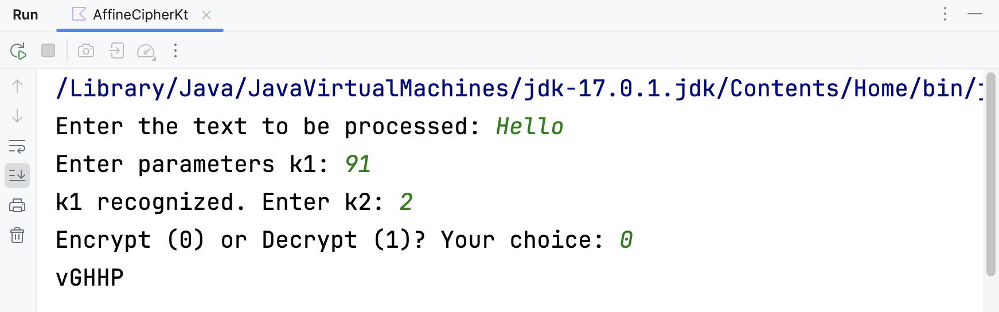

# 应用密码学与网络安全实验报告
## 实验一 古典密码实验
**实验目的**：了解并掌握Caesar密码、仿射密码和单表置换密码的加解密原理。
### Caesar密码
自选语言设计Caesar算法，并能任意指定英文字母组合和密钥对前者进行加密。
#### 实验原理
Caesar加密/解密是一种替换加密技术，明文中的所有字母都在字母表上向后（或向前）按照一个固定数目进行偏移后被替换成密文。例如，当偏移量是3的时候，明密文对照表可以如下所示：
<table>
  <tr>
    <td>明文</td><td>ABCDEFGHIJKLMNOPQRSTUVWXYZ</td>
  </tr>
  <tr>
    <td>密文</td><td>DEFGHIJKLMNOPQRSTUVWXYZABC</td>
  </tr>
</table>
这种加密方式非常容易受到选取语言的制约。例如，当对英语体系进行加密时，选择的偏移量显然不能超过25。因此，即使使用唯密文攻击，凯撒密码也是一种非常容易破解的加密方式。

#### 实验代码与运行记录
##### 加密算法
显然根据实验原理中所描述的定义和思路不难得到凯撒密码的加密算法。为了区分英文字母的大小写，大写字母的加密结果会变为小写，而小写则会被加密为大写。

算法中暗含了一个隐形的“明密文对照表”。英文Caesar密码的解密过程本质上是将密文进行新一轮加密，只是发生了反向的偏移。换言之，加密的偏移量
$k_e$
和解密时的偏移量
$k_d$
在处理英文文本时显然有
$k_d=26-k_e$
。利用此即可通过语言`kotlin`得到如下所示的算法代码。
```kotlin
private fun caesarCipher(text:String, key:Int, decryptMode:Boolean): String {
    val newKey=when(decryptMode){
        true -> 26-key
        else -> key
    }
    val textChars=text.toCharArray()
    val ansChars=CharArray(textChars.size)
    for(i in textChars.indices){
        if(textChars[i] in 'A'..'Z'){
            ansChars[i] = ((textChars[i].code-'A'.code+newKey)%26+'a'.code).toChar()
        }
        else if(textChars[i] in 'a'..'z'){
            ansChars[i] = ((textChars[i].code-'a'.code+newKey)%26+'A'.code).toChar()
        }
        else{
            ansChars[i]=textChars[i]
        }
    }
    return String(ansChars)
}
```

##### 运行结果

对该算法代码设计主程序的输入、输出。随后运行该程序；以加密时偏移量为5，并对文本“`Hello`”进行加密的情况为例，运行结果如下所示。

</img>

</img>

显然解密结果与原本的明文一致。

### 仿射密码

自选语言设计算法，使该算法能够对任意英文字母组合和密钥进行仿射加密。

#### 实验原理

仿射密码本质上与Caesar密码类似，也是一种替代加密技术。对总字母数量为
$m$
的语言体系中的任意字母
$x$
，其加密后的结果
$e(x)$
满足
$e(x)=ax+b\pmod{m}$
，其中
$a$
是与
$m$
互质的任意值，
$b$
是任意值。

与加密函数相对应地，解密函数为
$d(x)=a^{-1}(x-b)\pmod{m}$
，其中
$a^{-1}$
是
$a$
的一个取模倒数。

显然可以通过等式

$$
\begin{align}
\mbox{D}(\mbox{E}(x)) &= a^{-1}(\mbox{E}(x)-b)\mod{m}\\
  &= a^{-1}(((ax+b)\mod{m})-b)\mod{m} \\
  &= a^{-1}(ax+b-b)\mod{m} \\
  &= a^{-1}ax \mod{m}\\
  &= x\mod{m}.
\end{align}
$$

证明加密结果的解密结果就是原文本身。

#### 实验代码与运行记录

##### 算法代码

根据上方定义不难得到仿射加解密的算法。在讨论算法之前，首先要对算法中等式的一部分参数进行设计。

###### 互质

需要确保
$a$
与
$m$
互质。

```kotlin
private fun isPrior(a:Int,b:Int):Boolean{
    if(a==1||b==1) return true
    var realA=a
    var realB=b
    while(true)
    {
        val t = realA % realB
        if(t == 0)
        {
            break
        }
        else
        {
            realA = realB
            realB = t
        }
    }
    return realB <= 1
}
```

###### 取模倒数（乘法逆元）

生成
$a$
的取模倒数
$a^{-1}$
；此值应能确保与
$a$
的乘积对
$m$
的求余结果为1。

```kotlin
private fun inverseGenerator(a:Int,m:Int):Int{
    var result=0
    var i=0
    do{
        i++
        if(a*i%m==1){
            result=i
            break
        }
    }while(true)
    return result
}
```

###### 加密

由于是英文字母分大小写总共52个，故不妨令
$m=53$
。在这之后先生成一个暗含的明密文对照表`cipherSheet`，再根据此表通过`ReferenceForIndex`对每一个给定的字符查找到该字符在表中所对应的索引；类似地，再通过`cipherSheetReferenceForChar`可以找到特定索引号在表内所对应的字符。之后根据上述所有函数利用定义即可用`kotlin`写出算法代码如下所示。

```kotlin
private val cipherSheet=CharArray(55)

private fun cipherSheetReferenceForIndex(c:Char):Int{
    if(c in 'a'..'z') return c.code-'a'.code+1
    if(c in 'A'..'Z') return c.code-'A'.code+27
    return -1
}
private fun cipherSheetReferenceForChar(i:Int):Char{
    return cipherSheet[i]
}
private fun affineCipher(text:String,a:Int,b:Int,m:Int,decryptMode:Boolean):String{
    for(i in 0 until 26){
        cipherSheet[i+1]=(i+'a'.code).toChar()
        cipherSheet[i+27]=(i+'A'.code).toChar()
    }
    val textChars=text.toCharArray()
    val ansChars=CharArray(textChars.size)
    for(i in text.indices){
        val n = cipherSheetReferenceForIndex(text[i])
        if(n!=-1){
            val index = when(decryptMode) {
                true->(inverseGenerator(a,m) * (n - b + m)) % m
                else->(a*n+b)%m
            }
            ansChars[i]=cipherSheetReferenceForChar(index)
        }
        else{
            ansChars[i]=textChars[i]
        }
    }
    return String(ansChars)
}
```

##### 运行结果

根据算法代码设计输入输出，并运行该程序。以利用
$a=91,b=2$
对明文“`Hello`”进行加解密为例，得到的结果如下所示：

</img>

</img>

可以看到，解密的结果与原本的明文一致。
